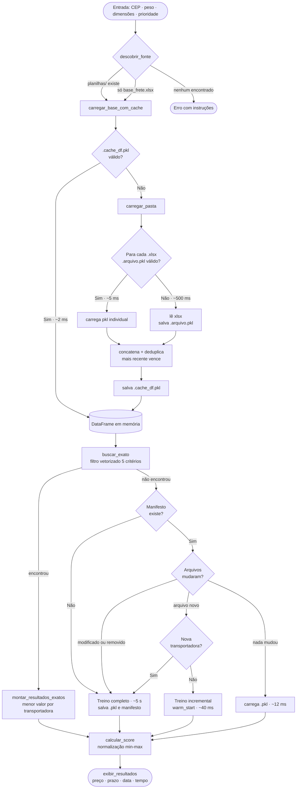
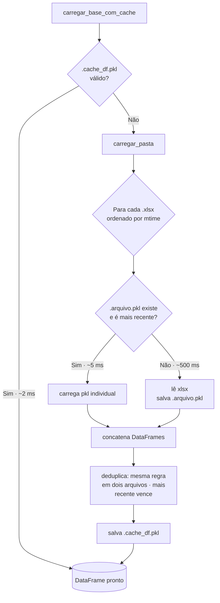
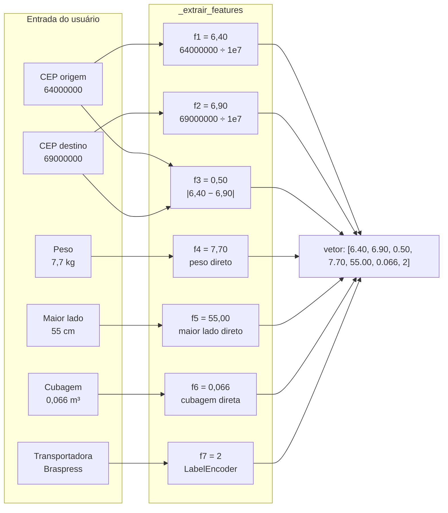
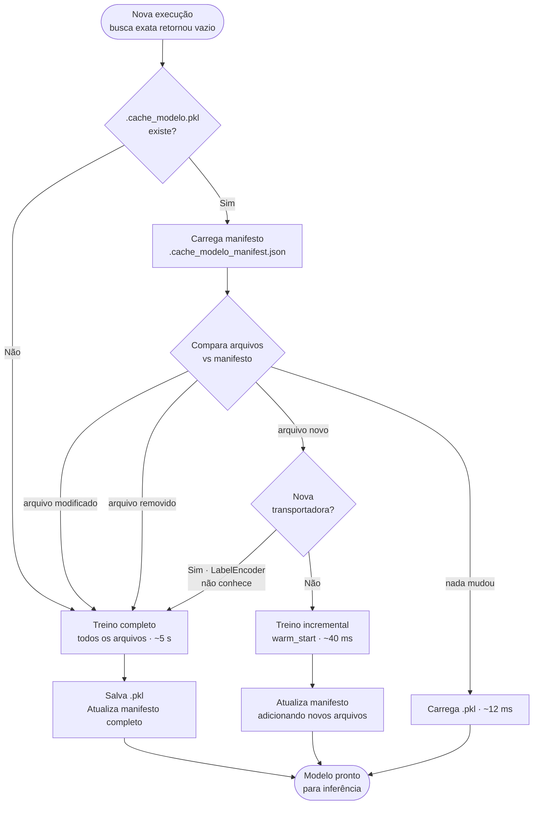

# Documentação Técnica — Sistema de Cálculo de Frete com ML

## Sumário

1. [Visão geral da arquitetura](#1-visão-geral-da-arquitetura)
2. [Fluxo de execução](#2-fluxo-de-execução)
3. [Módulo de busca exata](#3-módulo-de-busca-exata)
4. [Modelo de Machine Learning](#4-modelo-de-machine-learning) — algoritmo, features, inferência, cache evolutivo
5. [Algoritmo de score](#5-algoritmo-de-score)
6. [Cálculo de dias úteis e feriados](#6-cálculo-de-dias-úteis-e-feriados)
7. [Base de conhecimento (planilhas)](#7-base-de-conhecimento-planilhas)
8. [Referência de funções](#8-referência-de-funções)
9. [Como estender o sistema](#9-como-estender-o-sistema)
10. [Troubleshooting](#10-troubleshooting)

---

## 1. Visão geral da arquitetura



---

## 2. Fluxo de execução

### Passo 1 — Auto-detecção da fonte

Antes de qualquer interação com o usuário, o sistema resolve de onde vai ler os dados. Prioridade:

1. `--pasta` informado na linha de comando → usa a pasta indicada
2. `--planilha` informado → usa o arquivo indicado
3. Pasta `planilhas/` existe e contém `.xlsx` → **usa a pasta** (padrão)
4. Arquivo `base_frete.xlsx` existe → usa o arquivo
5. Nenhum encontrado → erro imediato com instruções

### Passo 2 — Entrada de dados do usuário

- **Modo direto:** parâmetros via CLI (`--cep-origem`, `--peso`, `--altura`, etc.)
- **Modo interativo:** `--interativo` solicita cada valor no terminal

Todos os CEPs são normalizados para inteiro de 8 dígitos: `01310-100` → `1310100`.
A cubagem é calculada automaticamente: `altura × largura × comprimento / 1.000.000`.

### Passo 3 — Carregamento da base com cache em camadas



### Passo 4 — Busca exata

Filtro booleano vetorizado. Uma linha satisfaz a consulta quando **todos** os cinco critérios são atendidos:

```
cep_origem_inicio ≤ CEP_orig ≤ cep_origem_fim
cep_destino_inicio ≤ CEP_dest ≤ cep_destino_fim
peso_min_kg ≤ peso < peso_max_kg
maior_lado_min_cm ≤ maior_lado < maior_lado_max_cm
cubagem_min_m3 ≤ cubagem < cubagem_max_m3
```

> O limite superior é **exclusivo** (`<`) para evitar captura dupla de um produto no limite exato de uma faixa.

### Passo 5 — Fallback ML (quando busca exata retorna vazio)

Ver seção 4 para detalhes completos do modelo e ciclo de treino.

### Passo 6 — Score e ordenação

Calcula o score combinado e ordena as opções. Ver seção 5.

### Passo 7 — Exibição

Converte prazo em dias úteis para data real de entrega, exibe ranking e tempo de cotação.

---

## 3. Módulo de busca exata

**Função:** `buscar_exato(df, cep_orig, cep_dest, peso, lado, cubagem)`

Implementada com operações vetorizadas do pandas — **não usa loops**. Para uma base de 22.000 linhas a execução é inferior a 5 ms.

```python
mask = (
    (df['cep_origem_inicio']  <= cep_orig)  & (df['cep_origem_fim']   >= cep_orig)  &
    (df['cep_destino_inicio'] <= cep_dest)  & (df['cep_destino_fim']  >= cep_dest)  &
    (df['peso_min_kg']        <= peso)      & (df['peso_max_kg']       >  peso)     &
    (df['maior_lado_min_cm']  <= lado)      & (df['maior_lado_max_cm'] >  lado)     &
    (df['cubagem_min_m3']     <= cubagem)   & (df['cubagem_max_m3']    >  cubagem)
)
```

**Quando a busca exata falha:**

- CEP não está coberto por nenhuma faixa
- Peso/dimensão/cubagem fora dos intervalos cadastrados
- Combinação válida individualmente mas inexistente em conjunto

---

## 4. Modelo de Machine Learning

### 4.1 Quando o modelo é ativado

O modelo ML é um **fallback**: só entra em cena quando a busca exata retorna vazio. Situações típicas:

- Rota entre regiões sem cobertura na tabela
- Produto com peso ou dimensão fora dos intervalos cadastrados
- Combinação válida individualmente mas inexistente em conjunto

### 4.2 Algoritmo

**Gradient Boosting Regressor** (scikit-learn) — ensemble de árvores de decisão rasas treinadas em sequência. Cada árvore aprende a corrigir os **resíduos** (erros) das anteriores.

Dois modelos independentes:

| Modelo | Alvo | Estimators | Profundidade | Learning rate |
|---|---|---|---|---|
| `modelo` | `valor_frete` (R$) | 300+ | 5 | 0,05 |
| `modelo_prazo` | `prazo_dias` (d.u.) | 200+ | 4 | 0,05 |

> O `+` indica que o número de estimators cresce com cada treino incremental.

### 4.3 Features — como os dados de entrada viram números

A função `_extrair_features()` transforma os dados em um vetor de **7 números**:



Durante o **treino**, usa-se o ponto médio de cada faixa da planilha (`peso_mid = (peso_min + peso_max) / 2`).  
Durante a **inferência**, usa-se o valor exato do produto do usuário.

### 4.4 Como o Gradient Boosting faz uma predição

O GBR é um **ensemble aditivo**: a predição é a soma das contribuições de todas as árvores.

```
ŷ = ŷ₀  +  lr × T₁(x)  +  lr × T₂(x)  +  ...  +  lr × T₃₀₀(x)
```

Onde `ŷ₀` é a média dos preços de treino, `Tᵢ(x)` é a predição da i-ésima árvore e `lr = 0,05` encolhe cada contribuição para evitar overfitting.

Cada árvore percorre divisões binárias até uma folha e retorna o resíduo médio dos exemplos de treino naquela folha. Após somar todas as contribuições, obtém-se o preço estimado.

### 4.5 `prever_todos()` — inferência por transportadora

Para cada cotação sem correspondência exata, o sistema itera sobre todas as transportadoras conhecidas e executa **duas inferências independentes**:

```
Para cada transportadora T:
  x = [CEP_orig/1e7, CEP_dest/1e7, dist, peso, lado, cub, enc(T)]
  preço = max(0.0, modelo.predict(x))
  prazo = max(1, round(modelo_prazo.predict(x)))
```

O `max(0.0, ...)` e `max(1, round(...))` evitam valores sem sentido físico causados por extrapolação.

### 4.6 Treinamento e avaliação

Split **85% treino / 15% validação** com `random_state=42`. O MAE é exibido no terminal:

```
Treinado em 5248 ms  |  MAE preço: R$ 18,59  |  MAE prazo: 0,3 d.u.
```

### 4.7 Cache em disco — o arquivo `.pkl`

`.pkl` é o formato **Pickle** — mecanismo nativo do Python para serializar qualquer objeto em bytes e gravá-lo no disco. Não é exclusivo de IA: poderia salvar uma lista ou dicionário. Aqui salva o modelo ML treinado, tornando-o um **modelo de IA empacotado e pronto para uso**.

**Conteúdo do `.cache_modelo.pkl`:**

```
.cache_modelo.pkl  (~2 MB)
│
├── modelo           GradientBoostingRegressor — preço
│   ├── estimators_  array N×1 com todas as árvores construídas
│   ├── learning_rate 0.05
│   └── init_        estimativa inicial (média dos preços de treino)
│
├── modelo_prazo     GradientBoostingRegressor — prazo
│
├── mae_preco        18.59
└── mae_prazo        0.3
```

**Analogia:** é como compilar um programa. O código não é recompilado a cada execução — compila-se uma vez e executa-se o binário. O `.pkl` é o "binário" do modelo treinado.

### 4.8 Ciclo de vida evolutivo do modelo — o manifesto

O maior ganho de performance vem de **não retreinar o que já foi aprendido**. O sistema usa um arquivo de manifesto (`.cache_modelo_manifest.json`) que registra exatamente quais arquivos foram usados no treino e com qual `mtime`.

**Conteúdo do manifesto:**

```json
{
  "frete_jan_2026.xlsx": 1780516244.023,
  "frete_fev_2026.xlsx": 1780516245.111
}
```

**Decisão na chegada de cada execução:**



**Treino incremental com warm_start:**

```
Estado antes (jan + fev treinados):
  modelo.estimators_ = 300 árvores  [sabe sobre jan e fev]

Chega frete_mar_2026.xlsx (800 linhas):
  modelo.warm_start = True
  modelo.n_estimators = 330  (adiciona 30 árvores)
  modelo.fit(X_mar, y_mar)   → treina só as 30 novas árvores nos dados de março

Estado depois:
  modelo.estimators_ = 330 árvores  [jan + fev intactos, +30 de março]
```

**Quando o treino incremental não é possível:**

Se o novo arquivo traz transportadoras desconhecidas, o `LabelEncoder` (que mapeia nome → número) não consegue codificá-las. Nesse caso o sistema força treino completo para recriar o encoder com todas as transportadoras.

**Resumo de tempo por operação:**

| Operação | Tempo |
|---|---|
| Treino completo (22.096 linhas, 300 árvores) | ~5.000 ms |
| Treino incremental (800 linhas novas, +30 árvores) | ~40 ms |
| Carga do modelo do cache `.pkl` | ~12 ms |
| Inferência pura (8 transportadoras) | < 2 ms |

### 4.9 Limitações do modelo ML

- Não interpola entre transportadoras — só estima para transportadoras que já existem na base
- Extrapola mal para regiões de CEP sem nenhuma cobertura no treino
- Transportadoras com poucos registros terão estimativas menos precisas
- O treino incremental (warm_start) é uma aproximação — as árvores novas não veem os dados antigos; para máxima precisão, use treino completo periodicamente

---

## 5. Algoritmo de score

**Função:** `calcular_score(resultados, w_preco)`

### Normalização min-max

```
preço_norm = (preço_i - preço_min) / (preço_max - preço_min)
prazo_norm = (prazo_i - prazo_min) / (prazo_max - prazo_min)
```

0 = melhor, 1 = pior dentro do conjunto de opções daquela consulta.

### Fórmula do score

```
score = w_p × preço_norm + w_t × prazo_norm
  w_p = prioridade_preco / 100
  w_t = 1 - w_p
```

### Casos especiais

| Situação | Comportamento |
|---|---|
| Todos os preços iguais | `preço_norm = 0` → prazo decide |
| Todos os prazos iguais | `prazo_norm = 0` → preço decide |
| Sem dado de prazo | `prazo_norm = 0.5` (posição neutra) |

### Exemplo

5 opções com `--prioridade-preco 50`:

| Transportadora | Preço | Prazo | preço_norm | prazo_norm | Score |
|---|---|---|---|---|---|
| Braspress | R$ 25,05 | 9 d.u. | 0,00 | 0,80 | **0,40** |
| Jadlog | R$ 36,32 | 8 d.u. | 0,20 | 0,60 | **0,40** |
| Total Express | R$ 42,52 | 7 d.u. | 0,31 | 0,40 | **0,35** ← melhor |
| Correios PAC | R$ 41,96 | 10 d.u. | 0,30 | 1,00 | **0,65** |
| SEDEX | R$ 81,95 | 5 d.u. | 1,00 | 0,00 | **0,50** |

---

## 6. Cálculo de dias úteis e feriados

### Feriados nacionais cobertos

| Feriado | Tipo |
|---|---|
| Confraternização Universal (01/jan) | Fixo |
| Carnaval — 2ª e 3ª feira | Móvel (47 e 46 dias antes da Páscoa) |
| Sexta-feira Santa | Móvel (2 dias antes da Páscoa) |
| Tiradentes (21/abr) | Fixo |
| Dia do Trabalho (01/mai) | Fixo |
| Corpus Christi | Móvel (60 dias após a Páscoa) |
| Independência (07/set) | Fixo |
| Nossa Senhora Aparecida (12/out) | Fixo |
| Finados (02/nov) | Fixo |
| Proclamação da República (15/nov) | Fixo |
| Natal (25/dez) | Fixo |

A data de Páscoa é calculada pelo algoritmo de Butcher/Jones, válido para qualquer ano gregoriano. Os feriados de cada ano são calculados uma vez e guardados em `_FERIADOS_CACHE`.

**Não são cobertos:** feriados estaduais, municipais e pontos facultativos. Ver nota no README sobre como estender.

---

## 7. Base de conhecimento (planilhas)

### Estrutura atual

| Métrica | Valor |
|---|---|
| Total de regras | 22.096 |
| Transportadoras | 8 |
| Regiões de CEP | 16 |
| Arquivos na pasta | 2 (jan + fev 2026) |

### Transportadoras

| Transportadora | Perfil | Prazo base | Arquivo de origem |
|---|---|---|---|
| Correios PAC | Econômico | 6 d.u. | frete_jan_2026.xlsx |
| Correios SEDEX | Expresso | 1 d.u. | frete_jan_2026.xlsx |
| Jadlog .Package | Econômico | 4 d.u. | frete_jan_2026.xlsx |
| Total Express | Padrão | 3 d.u. | frete_jan_2026.xlsx |
| Braspress | Carga | 5 d.u. | frete_jan_2026.xlsx |
| Sequóia | Expresso regional | 2 d.u. | frete_fev_2026.xlsx |
| Azul Cargo | Econômico | 3 d.u. | frete_fev_2026.xlsx |
| TNT Mercúrio | Premium expresso | 2 d.u. | frete_fev_2026.xlsx |

### Regiões de CEP

| Região | Faixa |
|---|---|
| SP Capital | 01000000 – 09999999 |
| SP Interior | 13000000 – 19999999 |
| RJ | 20000000 – 28999999 |
| ES | 29000000 – 29999999 |
| MG | 30000000 – 39999999 |
| BA | 40000000 – 48999999 |
| SE/AL | 49000000 – 49999999 |
| PE/PB | 50000000 – 58999999 |
| CE/RN | 59000000 – 63999999 |
| PI/MA | 64000000 – 65999999 |
| PA/AP | 66000000 – 68999999 |
| GO/DF | 70000000 – 77999999 |
| MT/MS | 78000000 – 79999999 |
| PR | 80000000 – 87999999 |
| SC | 88000000 – 89999999 |
| RS | 90000000 – 99999999 |

---

## 8. Referência de funções

| Função / Classe | Descrição |
|---|---|
| `descobrir_fonte()` | Auto-detecta `planilhas/` ou `base_frete.xlsx`; erro se nenhum encontrado |
| `normalizar_cep(valor)` | Converte CEP de qualquer formato para inteiro de 8 dígitos |
| `calcular_dimensoes(a, l, c)` | Retorna `(maior_lado_cm, cubagem_m3)` a partir das 3 dimensões em cm |
| `carregar_base(caminho)` | Lê e valida uma planilha Excel; interrompe com erro se colunas ausentes |
| `carregar_pasta(pasta)` | Lê todos `.xlsx` ordenados por mtime, deduplica, retorna df combinado |
| `carregar_base_com_cache(fonte)` | Orquestra cache combinado + cache por arquivo; usa xlsx só se necessário |
| `buscar_exato(df, ...)` | Filtro vetorizado pandas pelos 5 critérios simultâneos |
| `montar_resultados_exatos(exatos)` | Agrupa por transportadora, retém menor valor |
| `ModeloFrete.treinar(df)` | Treino completo nos dois GBR; retorna `(mae_preco, mae_prazo)` |
| `ModeloFrete.treinar_incremental(df_novo)` | warm_start: adiciona árvores treinadas só nos dados novos; retorna `False` se nova transportadora |
| `ModeloFrete.prever_todos(...)` | Inferência para todas as transportadoras conhecidas |
| `carregar_ou_treinar_modelo(df, fonte)` | Decide entre cache / incremental / completo via manifesto; salva `.pkl` e `.json` |
| `calcular_score(resultados, w_preco)` | Normalização min-max + ponderação → lista ordenada por score |
| `_calcular_feriados(ano)` | `set[date]` com 12 feriados nacionais do ano |
| `is_dia_util(d)` | `True` se não é fim de semana nem feriado nacional |
| `data_entrega(prazo_uteis, inicio)` | Data real contando `prazo_uteis` dias úteis a partir de `inicio` |
| `exibir_resultados(resultados, w_preco, elapsed_ms)` | Formata e imprime ranking com score, prazo, data e tempo |
| `coletar_interativo()` | Lê os 7 parâmetros do terminal |
| `main()` | Ponto de entrada: detecta fonte → coleta dados → busca → exibe |

---

## 9. Como estender o sistema

### Adicionar novas transportadoras

Crie um novo arquivo `.xlsx` em `planilhas/` com as regras da nova transportadora. Na próxima execução o sistema detecta o arquivo como novo e faz treino incremental — a menos que seja a primeira vez que essa transportadora aparece, caso em que força treino completo para recriar o `LabelEncoder`.

### Adicionar feriados estaduais ou municipais

Modifique `_calcular_feriados` para receber um estado:

```python
def _calcular_feriados(ano: int, estado: str = 'BR') -> set[date]:
    feriados = { ... }  # nacionais

    if estado == 'SP':
        feriados.add(date(ano, 7, 9))   # Revolução Constitucionalista
    if estado == 'RJ':
        feriados.add(date(ano, 1, 20))  # São Sebastião

    return feriados
```

### Adicionar um terceiro critério ao score

1. Adicione a coluna `confiabilidade` na planilha
2. Inclua-a em `montar_resultados_exatos` e `prever_todos`
3. Ajuste `calcular_score` para receber `w_confiabilidade` como terceiro peso
4. Adicione `--prioridade-confiabilidade` ao argparse

### Trocar o algoritmo de ML

Substitua `GradientBoostingRegressor` por qualquer estimador scikit-learn com `fit` / `predict`. Atenção: ao trocar o algoritmo, o `treinar_incremental` pode precisar ser revisado — `warm_start` é específico do GBR.

```python
from sklearn.ensemble import HistGradientBoostingRegressor  # mais rápido, suporta dados faltantes
from lightgbm import LGBMRegressor                          # muito mais rápido (pip install lightgbm)
```

### Forçar retreino completo

Delete os arquivos de cache e manifesto para forçar retreino do zero:

```bash
rm planilhas/.cache_modelo.pkl planilhas/.cache_modelo_manifest.json
```

---

## 10. Troubleshooting

### "Nenhuma fonte de dados encontrada"

Nenhum `.xlsx` em `planilhas/` e nenhum `base_frete.xlsx` no diretório atual. Opções:
1. Execute `python gerar_base_exemplo.py` para criar dados de exemplo
2. Coloque suas planilhas em `planilhas/`
3. Use `--planilha <arquivo>` ou `--pasta <pasta>`

### "Colunas obrigatórias ausentes"

A planilha não tem todas as colunas esperadas. Consulte a tabela em [README.md](README.md#estrutura-da-planilha).

### Todos os resultados vêm com `[ML (estimativa)]`

Nenhuma regra da planilha cobre a combinação informada. Verifique se:
- O CEP está dentro de alguma faixa cadastrada
- O peso/dimensão/cubagem está dentro de algum intervalo
- A combinação de todos os critérios juntos existe (cada um pode existir isoladamente)

### Treino completo inesperado ao adicionar novo arquivo

Causas possíveis:
- O novo arquivo tem transportadoras não vistas anteriormente → comportamento correto
- O manifesto foi deletado → o sistema não sabe o que já foi aprendido
- O arquivo existente foi re-salvo (mesmo conteúdo, mtime diferente) → o sistema interpreta como modificado

Para evitar o último caso, use `touch` somente no arquivo novo e não nos antigos.

### Cache com dados defasados após edição externa

Ferramentas que preservam o `mtime` original ao sobrescrever (alguns scripts `openpyxl`, `rsync --times`, restaurações de backup) não acionam a invalidação. Delete manualmente os caches:

```bash
rm planilhas/.cache_df.pkl planilhas/.frete_<nome>.pkl
rm planilhas/.cache_modelo.pkl planilhas/.cache_modelo_manifest.json
```

### O modelo ML demora muito para treinar

Reduza `n_estimators` em `ModeloFrete.__init__` ou substitua por `HistGradientBoostingRegressor`:

```python
from sklearn.ensemble import HistGradientBoostingRegressor
self.modelo = HistGradientBoostingRegressor(max_iter=300, max_depth=5, random_state=42)
```

### Score empata entre duas opções

O sistema mantém a ordem de inserção do pandas. Para desempatar pelo preço:

```python
return sorted(resultados, key=lambda r: (r['score'], r['valor_frete']))
```
